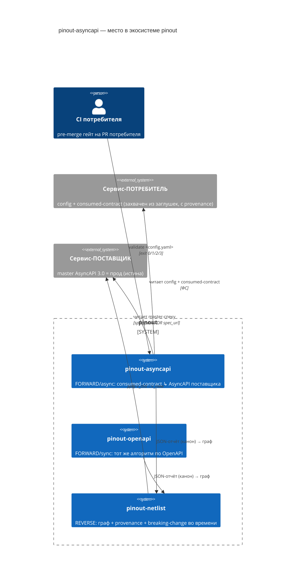
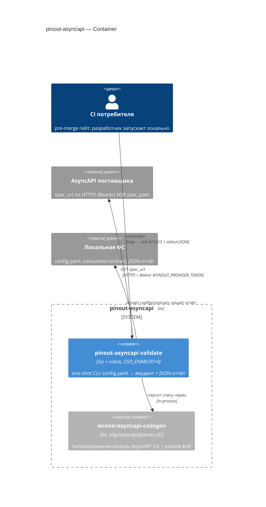
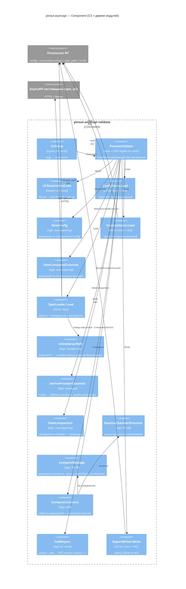

# pinout-asyncapi — концепт дизайна (как инструмент должен работать)

> Reference для чтения перед разработкой (вход харнеса — БТ в [`../TASK.md`](../TASK.md); дизайн-пакет
> харнес кладёт в `docs/design/slice-*/`). Часть экосистемы [pinout](../../pinout/README.md), эпик **E0**.
> Согласованная парадигма — [`../../pinout/docs/CONCEPT.md`](../../pinout/docs/CONCEPT.md)
> (bi-directional, consumed-contract, schema-vs-schema, provenance). Этот документ — её проекция на
> **async**-валидатор. Симметричен sync-близнецу [`../../pinout-openapi`](../../pinout-openapi) по
> конфигу, формату отчёта и exit-кодам.

---

## 1. Задача и несущий инвариант

В экосистеме сервисы общаются через брокер (Kafka/AMQP/MQTT/WebSocket/IBM MQ), и каждый описан
спецификацией **AsyncAPI 3.0**. Нужно в CI, **до мержа PR потребителя**, детерминированно ответить:
совместим ли потребитель с текущей спекой поставщика по тем каналам, которые он использует — без
поднятия брокера и без запуска сервисов.

> **Несущий инвариант:** каждый сервис конформен СВОЕЙ спеке — доказано его компонентными тестами.
> ⇒ структурная совместимость спек-пары = реальная совместимость сервисов.

Отсюда следует главное ограничение ответственности: инструмент **не проверяет** конформность сервиса
своей спеке (это компонентные тесты самого сервиса) и **не детектит** breaking-change во времени (это
`pinout-netlist`). Он отвечает ровно на один вопрос — «пара совместима СЕЙЧАС?».

## 2. Модель: что сравнивается с чем

**Источник истины — спека ПОСТАВЩИКА** (AsyncAPI 3.0). Ожидание потребителя живёт не в его
собственной спеке, а в **`consumed-contract`** — schema-shaped проекции «какие каналы зову × какие
поля **шлю** / **читаю**», авто-извлечённой из его компонентных заглушек и тестов и типизированной из
спеки поставщика на момент захвата, со штампом **provenance**.

Почему не полная AsyncAPI-спека потребителя (как делала v1): спека потребителя — декларация
намерений, а не зафиксированный факт использования. `consumed-contract` — captured-факт с provenance,
который `pinout-netlist` трекает на свежесть и авто-перепроверяет при изменении поставщика. Это же
условие симметрии с sync-близнецом, чей вход — тот же артефакт.

### Единица контракта и направления

| | sync (`pinout-openapi`) | **async (этот инструмент)** |
|---|---|---|
| Единица контракта | операция `path`+`method` | **канал** (по `address`) × **направление** |
| Что сверяем | схемы request / response | схемы **payload** и **headers** сообщений |
| Направления variance | request контравар. / response ковар. | **send** контравар. / **receive** ковар. |
| Транспорт | HTTP по построению | **протокол** из `servers` канала — сверяется явно |

### Ключевая инверсия направлений

Направление у потребителя и встречное направление у поставщика **инвертированы** — это несущая ось
алгоритма и ровно то, что v1 угадывал по протоколу:

```
consumer.sends[C]      ──шлёт──▶ [брокер, канал C] ──▶ provider operation action=receive  на C
consumer.receives[C]   ◀─читает─ [брокер, канал C] ◀── provider operation action=send     на C
```

Отсюда две правила-противоположности:

- **send — контравариантно:** поставщик не должен требовать того, чего потребитель не шлёт:
  `required(provider.receive[C]) ⊆ fields(consumer.sends[C])`.
- **receive — ковариантно:** потребитель не должен читать того, чего поставщик не отдаёт:
  `fields(consumer.receives[C]) ⊆ properties(provider.send[C])`.

Ковариантная проверка — не «приятное дополнение», а единственное, что ловит **удаление поля**
поставщиком: на открытой схеме (`additionalProperties` по умолчанию) наивная instance-валидация его
пропустит. Тот же вывод доказан для sync-близнеца в
[`../../pinout-openapi/sandbox/EXPERIMENT.md`](../../pinout-openapi/sandbox/EXPERIMENT.md).

### Паттерны коммуникации выводятся, а не задаются

Отдельной сущности «паттерн» в модели **нет**. Паттерн — следствие набора направлений канала:

| Направления канала в `consumed-contract` | Паттерн | Что проверяется |
|---|---|---|
| `sends` + `receives` | **request-reply** | оба правила variance |
| только `sends` | **fire-and-forget** | контравариантное правило |
| только `receives` | **publish-subscribe** | ковариантное правило |

Все три паттерна покрыты одним набором правил «даром». v1 вместо этого держал `switch` из трёх веток
с отдельной функцией на каждую — лишняя сущность, дающая три пути отказа вместо одного.

## 3. C4

### C1 — System Context



### C2 — Container



### C3 — Component (= дерево модулей, нода-в-ноду)

Зависимости направлены **внутрь**: ingress → head → {логика, I/O}. Логика ничего не знает про cobra /
http / os / time. Секрет, который прячет каждый модуль (Parnas) — решение, способное измениться без
правки вызывающих:

| Модуль | Единственный секрет, который он прячет |
|---|---|
| `cli` | как говорится вызов CLI (cobra, argv) и как сериализуется исход (exit-код, stdout/stderr) |
| `config` | формат файла конфига (YAML) и **правила его валидности** |
| `contract` | формат артефакта `consumed-contract` (channel × {sends,receives} + provenance) |
| `provider` | как спека **добывается и парсится** — file XOR http, предрезолв `#/servers/`, библиотека-парсер |
| `compare` | **правила совместимости R1–R9** — доменная семантика |
| `report` | форма отчёта канона `1.1` (`report.schema.json`) и как он сохраняется |



## 4. Алгоритм — верхний уровень

Чистая ROP-труба; шаг, вернувший ошибку, **короткозамыкает** остаток; `incompatible` — **вердикт, а не
ошибка**, он рождается на успешной ветке и сворачивается в отчёт.

```
ProcessValidate(inv) -> Result[Report, Error]:
  | ConfigStore.Load(inv.ConfigPath)              -> RawConfig          # ФС           [CONFIG_ERROR → 2]
  | NewConfig(raw)                                -> Config             # валидация    [CONFIG_ERROR → 2]
  | ContractStore.Load(cfg.ConsumedContractPath)  -> RawContract        # ФС+YAML      [FILE_NOT_FOUND → 3, PARSE_ERROR → 3]
  | NewConsumedContract(raw)                      -> ConsumedContract   # {channel × {sends,receives}} + provenance
  | BuildSpecLoader(cfg.Settings)                 -> loader             # ПОЗДНЯЯ сборка: timeout = cfg.Settings.Timeout
  | loader.Load(cfg.Provider)                     -> ProviderSpec       # file XOR http → InlineServerRefs → parser.FromYAML + Process()
  |                                                                     #              [FILE_NOT_FOUND, PARSE_ERROR, HTTP_ERROR, TIMEOUT_ERROR → 3]
  | DeriveProviderChannels(ProviderSpec)          -> map[address]PChan  # проекция: protocol + сообщения по направлениям
  | NewComparison(cfg, contract, pchans)          -> Comparison         # объединение уже валидных частей
  | CompareContracts(comparison)                  -> Outcome            # ЯДРО: R1..R9, свёртка по каналам → exit 1
  | FoldReport(outcome, inv.Now)                  -> Report             # канон 1.1: validator/interaction/consumer/generated_at/errors[].subject
  |                                                                     # compatible ⇔ errors == []; provenance; uncovered_channels[]
  |                                                                     # now инжектится сверху — ядро часы не читает (D10)
  | ReportWriter.Write(cfg.Settings, report)      -> Report             # запись iff save_json_report (сквозной проход)
  -> Ok(report)

затем в main: code := cli.ResolveExitCode(res); отчёт ВСЕГДА в stdout; логи в stderr; os.Exit(code)
```

Голова не ветвится и не содержит собственной логики — это прямая труба из уже спроектированных
частей. Ошибка поднимается **непреобразованной** и мапится в `(exit-код, error.code, stderr)`
**ровно один раз** — в адаптере `cli`.

### Ядро сверки — R1–R9

`CompareContracts` сворачивает нарушения по всем каналам из `consumer.channels`; ни одно правило не
короткозамыкает — один прогон может выдать несколько нарушений сразу.

**Уровень канала:**

- **R1 `CHANNEL_NOT_IN_PROVIDER`** — канала с таким `address` у поставщика нет.
- **R2 `PROTOCOL_MISMATCH`** — канал есть, но протокол (из `servers` канала) расходится с
  зафиксированным в контракте. Транспорт — часть контракта: `kafka`-топик и `amqp`-очередь с
  одинаковым адресом не одно и то же.
- **R3 `DIRECTION_NOT_IN_PROVIDER`** — у поставщика нет встречной операции для направления
  (потребитель шлёт, а у поставщика на этом канале нет `action: receive`; или наоборот). Отдельный
  код, а не «канал не найден»: диагностика принципиально разная.
- **R4 `MESSAGE_NOT_IN_PROVIDER`** — направление у поставщика есть, но названного сообщения среди его
  сообщений нет. Тоже отдельный код: «поставщик тут вообще не слушает» и «поставщик слушает, но не
  этот тип сообщения» чинятся по-разному.

**Уровень сообщения** (на каждое направление; `payload` и `headers` — по одним и тем же правилам):

- **R5 `MISSING_REQUIRED_SENT_FIELD`** — *контравариантно, для `sends`*:
  `required(provider) ⊆ fields(consumer.sends)`. Поставщик требует поле, которого потребитель не шлёт.
- **R6 `READS_FIELD_NOT_PROVIDED`** — *ковариантно, для `receives`*:
  `fields(consumer.receives) ⊆ properties(provider)`. Потребитель читает поле, которого поставщик не
  отдаёт (ловит удаление поля).
- **R7 `TYPE_MISMATCH`** — типы общих полей совпадают. **Рекурсивно**: вложенные объекты, `items`
  массивов, разыменованные `$ref`; сравниваются `type` и `format`. Глубина — даром от типизированной
  модели парсера.
- **R8 `CONTENT_TYPE_MISMATCH`** — `contentType` расходится. Эффективное значение у поставщика =
  `message.contentType`, иначе `defaultContentType` спеки. Правило срабатывает, **только если
  потребитель объявил `content_type`** в контракте.
- **R9 `CORRELATION_ID_MISMATCH`** — `correlationId.location` расходится. Правило срабатывает,
  **только если потребитель объявил `correlation_id_location`** — то есть реально коррелирует.

Про условие «только если потребитель объявил» в R8/R9 — см. [D9](#d9-r8r9-срабатывают-от-объявления-потребителя-а-не-от-паттерна).

Все R1–R9 → вердикт `incompatible`, **exit 1**. Каналы поставщика вне `consumer.channels` попадают в
`uncovered_channels[]` — информационно, без влияния на вердикт и exit-код.

### Карта режимов отказа

`incompatible` (exit 1) — честный доменный ответ. Exit 2/3 — ошибки инструмента на входной стороне.

| Exit | Класс | Коды |
|---|---|---|
| 0 | compatible | — (`compatible == true`, `errors == []`) |
| 1 | incompatible (вердикт) | `CHANNEL_NOT_IN_PROVIDER`, `PROTOCOL_MISMATCH`, `DIRECTION_NOT_IN_PROVIDER`, `MESSAGE_NOT_IN_PROVIDER`, `MISSING_REQUIRED_SENT_FIELD`, `READS_FIELD_NOT_PROVIDED`, `TYPE_MISMATCH`, `CONTENT_TYPE_MISMATCH`, `CORRELATION_ID_MISMATCH` |
| 2 | config | `CONFIG_ERROR` |
| 3 | io · parse | `FILE_NOT_FOUND`, `PARSE_ERROR`, `HTTP_ERROR`, `TIMEOUT_ERROR` |

`CONFIG_ERROR` детектится до того, как отчёт вообще пишется, поэтому он даёт exit 2, но никогда не
появляется в `errors[].code`. Правило: всё непроверенное или деградировавшее **видно** в отчёте — либо
`compatible == false` с записью в `errors[]`, либо ненулевой exit; никогда не маскируется под успех.

## 5. Решения и обоснования

### D1. Парсер — библиотека, не свой

`github.com/lerenn/asyncapi-codegen`, пакеты `pkg/asyncapi/parser` + `pkg/asyncapi/v3`, пин `v0.63.0`,
Apache 2.0. Проверено прогоном на реальных спеках репозитория: полная типизированная модель 3.0 —
`Channel.Address`, протокол через `Channel.Servers → Server.Protocol`, `Operation.Action` send/receive,
`Operation.Reply`, `Message.{Payload, Headers, ContentType, CorrelationID}`, рекурсивные `Schema` с
`Properties/Required/Items/Format`, резолв `$ref` через `Follow()`/`Reference*()`. Циклический `$ref`
не вешает `Process()`; висячий `$ref` даёт типизированную ошибку, не панику. В сборку тянутся три
зависимости, брокерных клиентов нет.

Альтернатива «свой парсер» отвергнута по фактическим данным v1: её `parser/` — 433 строки прод + 720
строк тестов при **неполной** модели (нет traits, `oneOf`, reply-address, bindings; ограниченные формы
`$ref`), плюс `$ref`-резолвинг протёк в `validator/` ещё на 366 строк. Хуже полноты — там схемы
де-типизировались в `map[string]interface{}` (`convertSchema`), и именно это сделало ядро сверки v1
хлипким. Библиотека даёт типизированную модель до листьев и снимает вечный долг сопровождения
спецификации.

### D2. Предрезолв `#/servers/*` — обход единственного дефекта библиотеки

`Specification.Process()` резолвит только корни `components` и `channels`; корень `#/servers/`
не поддержан и даёт `ErrInvalidReference`. Это канонная форма `channel.servers` по AsyncAPI 3.0 и
ровно наш шаг R2, так что обе реальные спеки репозитория падают на стоковой библиотеке.

Обход: модуль `InlineServerRefs` **до** парсинга декодирует документ в дерево, подставляет в
`channel.servers[]` тело сервера вместо `$ref` и отдаёт байты в стоковый `parser.FromYAML`. Работа
идёт по дереву YAML, не по тексту. Зависимость остаётся немодифицированной и обновляемой — без форка
и без ожидания upstream. Проверено: с этой правкой обе спеки парсятся целиком.

Альтернатива — форк с той же трёхстрочной правкой резолвера — отвергнута: вечное сопровождение форка
дороже одного изолированного модуля. Параллельно уместен PR в upstream; после мержа `InlineServerRefs`
удаляется вместе с его тестом, и это единственное место, которое придётся тронуть.

### D3. Проекция спеки поставщика: два обязательных разворачивания

`DeriveProviderChannels` строит из спеки отображение `address → {protocol, send: [msg], receive: [msg]}`.
Наивное чтение операций даёт неполную картину — нужны два разворачивания, и **оба обязательны**:

**Дефолт сообщений.** По AsyncAPI 3.0 `operation.messages` — подмножество сообщений канала, и
**отсутствие поля означает все сообщения канала**. В реальных спеках так почти всегда: в
`sandbox/provider/asyncapi.v1.yaml` поле не объявлено ни у одной из пяти операций, в спеках v1 — у
четырёх из пяти. Без разворачивания валидатор увидит «сообщений нет» и выдаст ложный вердикт по
каждому каналу.

**Разворачивание `reply`.** Операция вида `{action: A, reply: {channel: Cr, messages: M}}` вносит в
проекцию **противоположное A** направление на канале `Cr` с сообщениями `M` (или всеми сообщениями
`Cr`, если `M` опущено). Без этого поставщик, объявивший request-reply одной операцией и **не**
заведший отдельную операцию на канале ответа, выглядит как «не отдаёт ничего» — ложный R3.

### D4. Матч канала — по `address`, протокол — отдельное правило

Идентичность канала = его `address`; если `address` в спеке опущен, идентичностью служит ключ канала в
`channels`. Протокол не участвует в поиске — он сверяется отдельным правилом R2 с собственным кодом.

v1 делал наоборот: искал у поставщика **первый канал с совпадающим протоколом, игнорируя имя**. При
двух каналах одного протокола результат произволен, а расхождение транспорта маскировалось под «канал
не найден».

### D5. Форма отчёта — канон экосистемы `1.1`

Отчёт соответствует **канону экосистемы `1.1`**; источник истины формата —
`pinout-openapi/docs/report-format.md` (владелец — эпик E1). От sync-близнеца отличается ровно двумя
местами: enum `errors[].code` (async-коды R1–R9) и `uncovered_channels[]` вместо
`uncovered_operations[]`.

**Как канон дошёл до `1.1`.** Файл канона был удалён при clean slate, и пока его не было, оба
валидатора заморозили собственную **плоскую** форму отчёта — под тем же номером `1.0`, что и у
удалённой спеки, но структурно от неё отличную. Это форк версии, а не потеря файла, и починка
откатом (`git show … > report-format.md`) воскресила бы спеку, противоречащую двум замороженным
контрактам. Решение оператора (вариант A, разбор —
[`../../pinout/debt/report-canon-fork.md`](../../pinout/debt/report-canon-fork.md)) — согласовать
версию вперёд: канон `1.1` как **аддитивная надстройка над фактической плоской формой**, с сохранением
`additionalProperties: false`.

Что добавляет `1.1` поверх нашей формы `1.0`: `validator`, `interaction`, `consumer{name}`,
`generated_at` и `errors[].subject`. Мотив не косметический — без `consumer.name` и `interaction`
`pinout-netlist` физически не может построить ребро consumer↔provider: поставщика он знает из
`provenance`, а потребителя в отчёте не было вообще.

Чего в `1.1` намеренно **нет** — отдельного блока `provider{}`: единственным источником идентичности
поставщика объявлен `provenance`, который строго сильнее (несёт `captured_hash`, по нему netlist
трекает свежесть). И не появилось `verdicts[]` из старой спеки: `errors[].subject` даёт netlist ту же
субъектную гранулярность без реструктуризации отчёта, которую netlist всё равно разложил бы обратно
в плоский список.

### D6. Формат `consumed-contract` — свой frozen-контракт в этом репозитории

`api-specification/consumed-contract.schema.json` — третий замороженный контракт наряду с конфигом и
отчётом. Async-форма (канал × направление) не выводится натяжением sync-формы (там ключ `path`+`method`).
E-harness сегодня async-контракт не генерит; заморозив формат здесь, мы делаем валидатор
самодостаточным и задаём цель для доработки скилла `component-tests` — это **внешняя зависимость
экосистемы, а не блокер этого репозитория**.

### D7. Вложение множеств, а не идентичность

v1 требовал `areRequiredFieldsSetsIdentical` — точного совпадения множеств `required`. Это противоречит
[`../../pinout/docs/CONCEPT.md`](../../pinout/docs/CONCEPT.md) §3 и даёт ложный `incompatible` каждый
раз, когда поставщик легально расширяет сообщение. Заменено на вложение по направлениям (R5/R6), из-за
чего направление перестало быть косметикой и стало несущей осью модели.

### D8. Ключ пары сообщений — ключ map `channel.messages`, а не `Message.Name`

Сообщения потребителя и поставщика внутри одного направления паруются по имени. Имя нужно взять
правильное: `Specification.Process()` библиотеки **перезаписывает** поле `Message.Name`
сгенерированным Go-идентификатором. Проверено на нашей же sandbox-спеке — `name: GetBalanceResponse`
после `Process()` превращается в `GetBalanceResponseMessage`
(`pkg/asyncapi/v3/message.go:73`, `generateFullName(parentName, name, "Message", number)`).

Ключи map при этом **сохраняются**, поэтому ключом пары служит ключ в `channel.messages`
(`getBalanceResponse`). Именно он, а не ключ в `components.messages` (`GetBalanceResponse`): контракт
захватывается по каналам, и на канале сообщение адресуется своим канальным ключом. Ровно этот ключ
кладётся в `consumed-contract` `message.name` и печатается в `location` отчёта. Опора на
`Message.Name` дала бы несовпадение пар на каждом сообщении и лавину ложных R4.

### D9. R8/R9 срабатывают от объявления потребителя, а не от паттерна

Первая редакция правил гласила: `correlationId` проверять «только на канале с обоими направлениями
(request-reply)». Трассировка показала, что такое условие **не срабатывает никогда** на типичной
спеке: в AsyncAPI 3.0 request-reply выражается операцией с `reply`, и адрес ответа обычно **другой**
(в нашей паре — `WALLET.BALANCE.REQUEST` и `WALLET.BALANCE.RESPONSE`). Ни у одного канала нет обоих
направлений, значит правило мертво именно там, ради чего вводилось.

Исправлено на условие, согласованное с variance-моделью: **R8/R9 срабатывают тогда и только тогда,
когда соответствующий атрибут объявил потребитель.** Объявил `correlation_id_location` — значит
реально коррелирует, и поставщик обязан объявить такой же; не объявил — проверять нечего, а
поставщицкий `correlationId`, который потребитель игнорирует, есть законное расширение (та же
ковариантность, что и в R6). Симметрично для `content_type` в R8.

v1 здесь требовала совпадения `correlationId` **всегда**, включая одностороннее наличие — источник
ложных срабатываний на fire-and-forget и pub-sub, где коррелировать нечего.

### D10. `generated_at` — через шов часов, а не системные часы внутри ядра

`generated_at` — **единственная неаддитивная** часть канона `1.1`: это значение, которого нет ни в
одном входном артефакте. Время **инжектится сверху** портом часов и доходит до `FoldReport`
параметром; ядро системные часы не читает.

Иначе ломается несущее свойство инструмента — детерминизм «одни и те же входные байты ⇒ те же байты
отчёта». Компонентные сценарии сравнивают отчёт целиком; отчёт со «свежим временем» внутри не
сравним ни с чем, и единственным выходом останется исключать поле из сравнения — то есть перестать
проверять его вовсе. Требование зафиксировано в DoD ([`../TASK.md`](../TASK.md)) как констрейнт для
реализации E0.

### D11. `subject` — префикс `location`, вычисляемый один раз

`errors[].subject` и `errors[].location` не независимые строки: `location` = `subject` + путь поля.
Реализация обязана выделять `subject` из **одного** вычисления, а не собирать его вторым конкатом —
иначе они разъезжаются, и netlist ключуется по одному значению, а человек читает другое.

Для verdict-кодов R1–R9 `subject` — async-субъект `<address> [<direction> <message key>]`. Для
io/parse-кодов канала нет, поэтому субъектом служит **входной артефакт**, на котором сломались
(`spec_url`/`spec_path` поставщика или путь `consumed-contract`) — так поле остаётся обязательным без
пустых заглушек и остаётся осмысленным для netlist.

## 6. Границы

**Не делает:** не поднимает брокер и не гоняет тесты; не сравнивает две полные спеки; не детектит
breaking-change во времени (это `pinout-netlist`); не проверяет конформность сервиса своей спеке (это
его компонентные тесты); не генерирует клиент и не извлекает `consumed-contract` (его поставляет
E-harness, типизированным); не сверяет больше одного поставщика за прогон.

**Границы MVP:** внешние файловые `$ref` (`./common.yaml#/...`) не поддерживаются — ни библиотекой, ни
парсером v1; спека должна быть самодостаточной. Композиция схем (`allOf`/`anyOf`/`oneOf`) в сверке не
разворачивается. Бindings протоколов не сверяются — протокол проверяется на уровне канала (R2).
Отсутствие `address` у канала обрабатывается фолбэком на ключ (D4), динамические адреса с параметрами
сравниваются как шаблон-строка.

## 7. Дуальность экосистемы

| | FORWARD (`pinout-asyncapi` / `pinout-openapi`) | REVERSE (`pinout-netlist`) |
|---|---|---|
| Триггер | PR **потребителя** | PR **поставщика** |
| Вопрос | «я совместим СЕЙЧАС?» | «кого я сломаю ЭТИМ?» |
| Вход | спека поставщика + `consumed-contract` (provenance) | поставщик **v_old→v_new** + граф |
| Механизм | schema-vs-schema по направлениям | диф во времени + граф зависимостей |
| Роль | пара **сейчас** | история **во времени** |

Оба стоят на одном: спека поставщика — истина; потребитель конформен через свои заглушки и тесты.

## 8. Куда смотреть дальше

1. [`../TASK.md`](../TASK.md) — БТ и Definition of Done (вход харнеса).
2. `api-specification/` — три замороженных контракта: [конфиг](../api-specification/config.schema.json),
   [отчёт](../api-specification/report.schema.json),
   [consumed-contract](../api-specification/consumed-contract.schema.json).
3. [`../sandbox/EMULATION.md`](../sandbox/EMULATION.md) — сухая трассировка алгоритма по 17 сценариям:
   доказательство, что модель непротиворечива и каждый код достижим.
