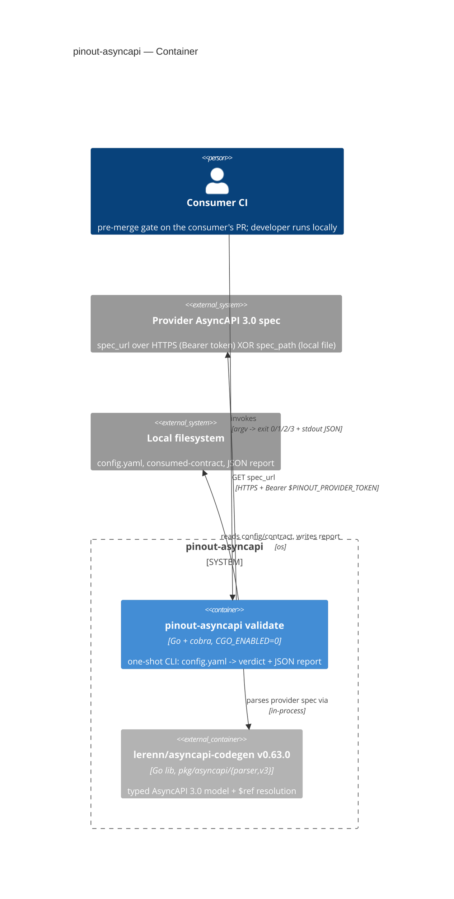

# slice-01-validate — C4 (C2 Container + C3 Component)

> `c4` skill output. C1 (system context) → [`../../concept.md`](../../concept.md) §3 (C1) / the
> platform landing. C3 below is node-for-node the module tree in
> [`module-tree.md`](./module-tree.md) §3 (21 nodes); module contracts (`io:` tags,
> antecedent/consequent) → [`contracts.md`](./contracts.md). Cockburn use case (not re-authored
> here) → [`use-case.md`](./use-case.md).
>
> **Current as of change [`001-pipe-arity-coverage-gaps`](./changes/001-pipe-arity-coverage-gaps/)**
> (lane `patch`): C2 unchanged; C3 carries the two factory/product-method splits and the
> bind-then-chain flow.

## C2 — Container

One deployable unit (the CLI binary) + one honestly-reused library, filled from the stack
(`Go + cobra`, `CGO_ENABLED=0`, `github.com/lerenn/asyncapi-codegen@v0.63.0`).



## C3 — Component (= the module tree, node-for-node)

Dependencies point **inward**: ingress → head → {logic, I/O}. Logic (`newcfg`, `buildparser`,
`parser`, `inlinerefs`, `derive`, `newcmp`, `resolve`, `cmpmsg`, `cmpc`, `buildreporter`,
`reporter`, `buildspec`, `buildwriter`) knows nothing of cobra/http/os/time; the four I/O objects
(`cfgstore`, `ctrstore`, `filespec`/`httpspec`, `writer`) are the only externally-connected
components and are pipes — no transformations beyond the one documented pre-resolve step
(`module-tree.md` §3).

**Reading the four factories.** `buildparser`, `buildspec`, `buildreporter`, `buildwriter` are
**binds, not pipe steps**: the head calls them once each, before the chain, to turn environment and
already-validated config scalars into collaborators. Each is drawn with a `constructs` arrow to its
product. That is what lets every chain step carry exactly one data entity.

```mermaid
C4Component
    title pinout-asyncapi — Component (slice slice-01-validate)
    Container_Boundary(app, "pinout-asyncapi validate") {
        Component(parse, "cli.Parse", "ingress (io: none)", "argv -> Invocation")
        Component(head, "ProcessValidate", "head - ROP pipe (io: none)", "bind-then-chain, no branching")
        Component(exit, "cli.ResolveExitCode", "egress adapter (io: none)", "total over any error -> exit 0/1/2/3, default 3")
        Component(cfgstore, "ConfigStore.Load", "I/O (io: none - fs)", "pipe - no transformations")
        Component(newcfg, "NewConfig", "logic: constructor (io: none)", "valid-by-construction Config")
        Component(ctrstore, "ContractStore.Load", "I/O (io: none - fs)", "pipe - no transformations")
        Component(buildparser, "BuildContractParser", "logic: factory (io: none)", "binds the expected consumer name")
        Component(parser, "ContractParser.Parse", "logic: constructor (io: none)", "valid-by-construction ConsumedContract")
        Component(buildspec, "BuildSpecLoader", "logic: factory (io: none)", "selects FileSpecLoader XOR HTTPSpecLoader")
        Component(filespec, "FileSpecLoader.Load", "I/O (io: none - fs)", "pipe - no transformations")
        Component(httpspec, "HTTPSpecLoader.Load", "I/O (io: http)", "pipe - no transformations")
        Component(inlinerefs, "InlineServerRefs", "logic: pre-resolve (io: none)", "#/servers/* -> inlined (D2 workaround)")
        Component(derive, "DeriveProviderChannels", "logic: projection (io: none)", "spec -> {address, protocol, send/receive msgs}")
        Component(newcmp, "NewComparison", "logic: uniting constructor (io: none)", "validates the ComparisonInput join; channel-scope check")
        Component(resolve, "ResolveChannelDirection", "logic: R1-R4 (io: none)", "channel, protocol, direction")
        Component(cmpmsg, "CompareMessage", "logic: R5-R9 (io: none)", "field-set variance, type, contentType, correlationId")
        Component(cmpc, "CompareContracts", "logic: fold (io: none)", "accumulates violations + uncovered_channels")
        Component(buildreporter, "BuildReporter", "logic: factory (io: none)", "binds the clock port - the slice's only time source (D10)")
        Component(reporter, "Reporter.Fold", "logic: DTO assembly (io: none)", "Outcome -> canon 1.1 Report, one clock read")
        Component(buildwriter, "BuildReportWriter", "logic: factory (io: none)", "encapsulates whether/where to persist")
        Component(writer, "ReportWriter.Write", "I/O (io: none - fs)", "pipe - no transformations")
    }
    System_Ext(fs, "Local filesystem", "config.yaml / consumed-contract / spec_path / report")
    System_Ext(prov, "Provider AsyncAPI 3.0 (spec_url)", "HTTPS + Bearer")
    System_Ext(lib, "lerenn/asyncapi-codegen", "typed parse + $ref resolution")
    Rel(parse, head, "Invocation")
    Rel(head, cfgstore, "Load(ConfigPath)")
    Rel(head, newcfg, "NewConfig(raw)")
    Rel(head, buildparser, "BuildContractParser(cfg.Consumer.Name) - bind")
    Rel(buildparser, parser, "constructs")
    Rel(head, buildspec, "BuildSpecLoader(cfg.Provider) - bind")
    Rel(buildspec, filespec, "constructs, iff spec_path")
    Rel(buildspec, httpspec, "constructs, iff spec_url")
    Rel(head, buildreporter, "BuildReporter(deps.Clock) - bind")
    Rel(buildreporter, reporter, "constructs")
    Rel(head, buildwriter, "BuildReportWriter(cfg.Settings) - bind")
    Rel(buildwriter, writer, "constructs")
    Rel(head, ctrstore, "Load(ConsumedContractPath)")
    Rel(head, parser, "Parse(raw)")
    Rel(head, filespec, "Load(), iff spec_path")
    Rel(head, httpspec, "Load(), iff spec_url")
    Rel(filespec, inlinerefs, "pre-resolve before parse")
    Rel(httpspec, inlinerefs, "pre-resolve before parse")
    Rel(head, derive, "DeriveProviderChannels(spec)")
    Rel(head, newcmp, "NewComparison(ComparisonInput)")
    Rel(head, cmpc, "CompareContracts(comparison)")
    Rel(cmpc, resolve, "per channel/direction")
    Rel(cmpc, cmpmsg, "per message pair")
    Rel(head, reporter, "Fold(outcome)")
    Rel(head, writer, "Write(report)")
    Rel(head, exit, "Result<Report, Error>")
    Rel(cfgstore, fs, "read", "os")
    Rel(ctrstore, fs, "read", "os")
    Rel(filespec, fs, "read spec_path", "os")
    Rel(httpspec, prov, "GET spec_url", "HTTPS")
    Rel(filespec, lib, "FromYAML(...).Process()", "in-process")
    Rel(httpspec, lib, "FromYAML(...).Process()", "in-process")
    Rel(writer, fs, "write, iff save_json_report", "os")
```



### Head-pipe flow (one line, from `module-tree.md` §4)

```
cli.Parse -> ProcessValidate:
  stage 0: ConfigStore.Load -> NewConfig
  bind:    BuildContractParser | BuildSpecLoader | BuildReporter | BuildReportWriter   (total, no I/O)
  chain:   ContractStore.Load -> ContractParser.Parse -> SpecLoader.Load (-> InlineServerRefs -> lib.Process()) ->
           DeriveProviderChannels -> NewComparison(ComparisonInput) ->
           CompareContracts (-> ResolveChannelDirection, CompareMessage) ->
           Reporter.Fold -> ReportWriter.Write
-> cli.ResolveExitCode
```

Every node in `chain:` takes exactly one data entity; the `bind:` group takes construction
parameters, which are not pipe inputs (`module-tree.md` §3, "One data argument — no exceptions").

Neighbor docs: [`use-case.md`](./use-case.md) (Cockburn UC1), C1 → `../../concept.md` §3.

<!-- DONE: c4 slice-01-validate -->
<!-- DONE: moduledesigner slice-01-validate -->
