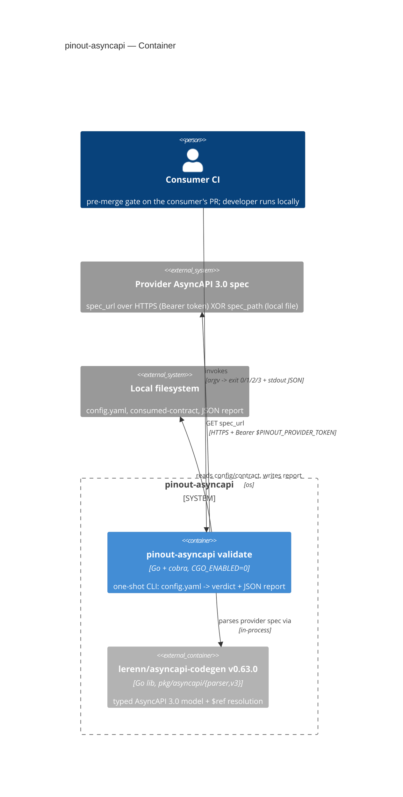

# slice-01-validate — C4 (C2 Container + C3 Component)

> `c4` skill output. C1 (system context) → [`../../concept.md`](../../concept.md) §3 (C1) / the
> platform landing. C3 below is node-for-node the module tree in
> [`module-tree.md`](./module-tree.md) §3; module contracts (`io:` tags, antecedent/consequent) →
> [`contracts.md`](./contracts.md). Cockburn use case (not re-authored here) →
> [`use-case.md`](./use-case.md).

## C2 — Container

One deployable unit (the CLI binary) + one honestly-reused library, filled from the stack
(`Go + cobra`, `CGO_ENABLED=0`, `github.com/lerenn/asyncapi-codegen@v0.63.0`).



## C3 — Component (= the module tree, node-for-node)

Dependencies point **inward**: ingress → head → {logic, I/O}. Logic (`newcfg`, `newctr`,
`inlinerefs`, `derive`, `newcmp`, `resolve`, `cmpmsg`, `cmpc`, `fold`, `buildspec`,
`buildwriter`) knows nothing of cobra/http/os/time; the four I/O objects (`cfgstore`, `ctrstore`,
`filespec`/`httpspec`, `writer`) are the only externally-connected components and are pipes — no
transformations beyond the one documented pre-resolve step (`module-tree.md` §3).

```mermaid
C4Component
    title pinout-asyncapi — Component (slice slice-01-validate)
    Container_Boundary(app, "pinout-asyncapi validate") {
        Component(parse, "cli.Parse", "ingress (io: none)", "argv -> Invocation")
        Component(head, "ProcessValidate", "head - ROP pipe (io: none)", "linear orchestration, no branching")
        Component(exit, "cli.ResolveExitCode", "egress adapter (io: none)", "Result -> exit 0/1/2/3 + stdout/stderr")
        Component(cfgstore, "ConfigStore.Load", "I/O (io: none - fs)", "pipe - no transformations")
        Component(newcfg, "NewConfig", "logic: constructor (io: none)", "valid-by-construction Config")
        Component(ctrstore, "ContractStore.Load", "I/O (io: none - fs)", "pipe - no transformations")
        Component(newctr, "NewConsumedContract", "logic: constructor (io: none)", "valid-by-construction ConsumedContract")
        Component(buildspec, "BuildSpecLoader", "logic: factory (io: none)", "selects FileSpecLoader XOR HTTPSpecLoader")
        Component(filespec, "FileSpecLoader.Load", "I/O (io: none - fs)", "pipe - no transformations")
        Component(httpspec, "HTTPSpecLoader.Load", "I/O (io: http)", "pipe - no transformations")
        Component(inlinerefs, "InlineServerRefs", "logic: pre-resolve (io: none)", "#/servers/* -> inlined (D2 workaround)")
        Component(derive, "DeriveProviderChannels", "logic: projection (io: none)", "spec -> {address, protocol, send/receive msgs}")
        Component(newcmp, "NewComparison", "logic: uniting constructor (io: none)", "unites Config+Contract+Channels; channel-scope check")
        Component(resolve, "ResolveChannelDirection", "logic: R1-R4 (io: none)", "channel, protocol, direction")
        Component(cmpmsg, "CompareMessage", "logic: R5-R9 (io: none)", "field-set variance, type, contentType, correlationId")
        Component(cmpc, "CompareContracts", "logic: fold (io: none)", "accumulates violations + uncovered_channels")
        Component(fold, "FoldReport", "logic: DTO assembly (io: none)", "Outcome + clock.Now() once -> canon 1.1 Report")
        Component(buildwriter, "BuildReportWriter", "logic: factory (io: none)", "encapsulates whether/where to persist")
        Component(writer, "ReportWriter.Write", "I/O (io: none - fs)", "pipe - no transformations")
    }
    System_Ext(fs, "Local filesystem", "config.yaml / consumed-contract / spec_path / report")
    System_Ext(prov, "Provider AsyncAPI 3.0 (spec_url)", "HTTPS + Bearer")
    System_Ext(lib, "lerenn/asyncapi-codegen", "typed parse + $ref resolution")
    Rel(parse, head, "Invocation")
    Rel(head, cfgstore, "Load(ConfigPath)")
    Rel(head, newcfg, "NewConfig(raw)")
    Rel(head, ctrstore, "Load(ConsumedContractPath)")
    Rel(head, newctr, "NewConsumedContract(raw, consumerName)")
    Rel(head, buildspec, "BuildSpecLoader(provider)")
    Rel(buildspec, filespec, "constructs, iff spec_path")
    Rel(buildspec, httpspec, "constructs, iff spec_url")
    Rel(head, filespec, "Load(), iff spec_path")
    Rel(head, httpspec, "Load(), iff spec_url")
    Rel(filespec, inlinerefs, "pre-resolve before parse")
    Rel(httpspec, inlinerefs, "pre-resolve before parse")
    Rel(head, derive, "DeriveProviderChannels(spec)")
    Rel(head, newcmp, "NewComparison(cfg, contract, pchans)")
    Rel(head, cmpc, "CompareContracts(comparison)")
    Rel(cmpc, resolve, "per channel/direction")
    Rel(cmpc, cmpmsg, "per message pair")
    Rel(head, fold, "FoldReport(outcome)")
    Rel(head, buildwriter, "BuildReportWriter(settings)")
    Rel(head, writer, "Write(report)")
    Rel(head, exit, "Result<Report, Error>")
    Rel(cfgstore, fs, "read", "os")
    Rel(ctrstore, fs, "read", "os")
    Rel(filespec, fs, "read spec_path", "os")
    Rel(httpspec, prov, "GET spec_url", "HTTPS")
    Rel(filespec, lib, "FromYAML(...).Process()", "in-process")
    Rel(httpspec, lib, "FromYAML(...).Process()", "in-process")
    Rel(writer, fs, "write, iff save_json_report", "os")
```



### Head-pipe flow (one line, from `module-tree.md` §4)

```
cli.Parse -> ProcessValidate: ConfigStore.Load -> NewConfig -> ContractStore.Load ->
NewConsumedContract -> BuildSpecLoader -> SpecLoader.Load (-> InlineServerRefs -> lib.Process()) ->
DeriveProviderChannels -> NewComparison -> CompareContracts (-> ResolveChannelDirection, CompareMessage) ->
FoldReport -> BuildReportWriter -> ReportWriter.Write -> cli.ResolveExitCode
```

Neighbor docs: [`use-case.md`](./use-case.md) (Cockburn UC1), C1 → `../../concept.md` §3.

<!-- DONE: c4 slice-01-validate -->
